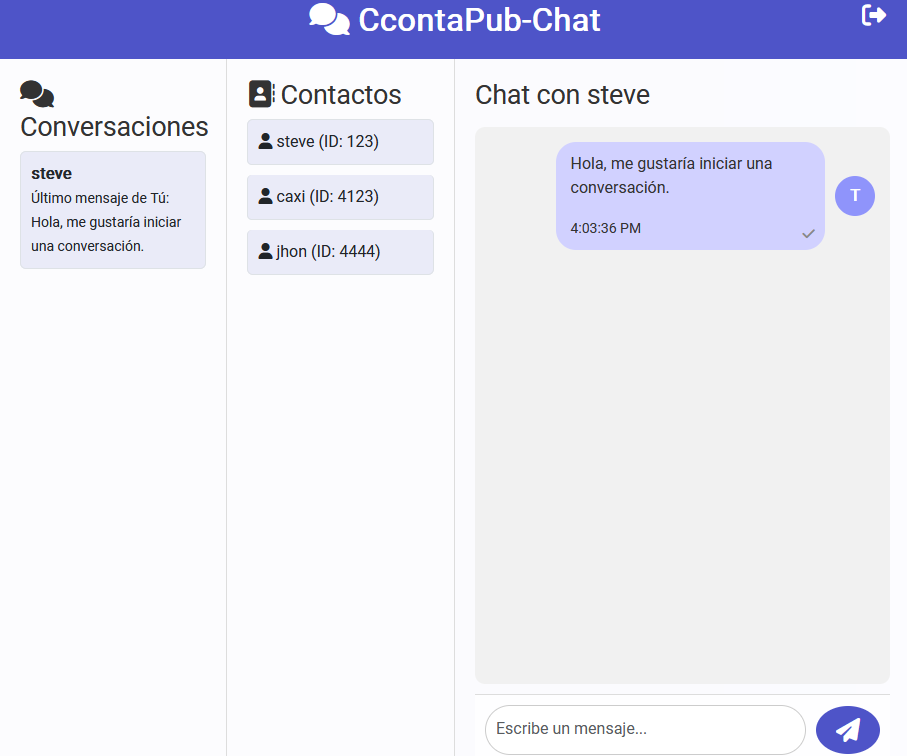
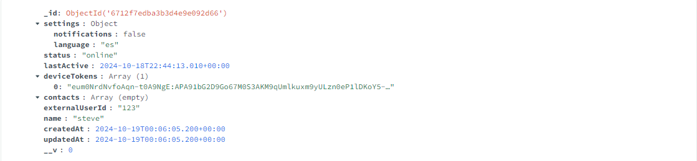

# CcontaPub - Sistema de Comunicación Profesional para Contadores
#Repositorio Publico
(https://github.com/STEVE-DNF/SM2_EXAMEN_PRACTICO)


## Descripción del Proyecto

CcontaPub es una plataforma innovadora diseñada específicamente para satisfacer las necesidades de comunicación de los contadores públicos. El proyecto se centra en proporcionar un espacio seguro y eficiente para el intercambio de información profesional, implementando dos funcionalidades críticas del Epic EP-05.

### Problemática Abordada
Los contadores públicos frecuentemente necesitan:
- Compartir información sensible de manera segura
- Mantener comunicación profesional en tiempo real
- Recibir notificaciones importantes sobre actualizaciones contables
- Gestionar múltiples conversaciones profesionales

### Solución Implementada
Para abordar estas necesidades, se han desarrollado dos funcionalidades principales:

## 1. Sistema de Chat Privado (EP-05)
Sistema de mensajería en tiempo real que permite la comunicación segura entre profesionales contables.

### Características Implementadas:
- Chats privados uno a uno
- Cifrado de extremo a extremo
- Historial de conversaciones
- Indicadores de estado de lectura
- Búsqueda de mensajes
- Formato de texto enriquecido para compartir información técnica


*Interfaz del sistema de chat mostrando una conversación activa entre profesionales*

### Aspectos Técnicos Destacados:
```javascript
// Ejemplo de implementación de mensaje cifrado
const encryptMessage = (message) => {
  return {
    content: encrypt(message.content),
    timestamp: Date.now(),
    sender: message.sender,
    receiver: message.receiver,
    status: 'sent'
  };
};
```

## 2. Sistema de Notificaciones Inteligente (EP-05)
Sistema de notificaciones en tiempo real que mantiene a los usuarios informados sobre actividades relevantes.

### Características Implementadas:
- Notificaciones push personalizables
- Alertas de nuevos mensajes
- Recordatorios de mensajes sin leer
- Notificaciones de estado de conexión
- Priorización inteligente de alertas


*Panel de control del sistema de notificaciones mostrando diferentes tipos de alertas*

### Configuración de Notificaciones:
```javascript
// Ejemplo de configuración de notificaciones
const notificationConfig = {
  priority: {
    messages: 'high',
    updates: 'medium',
    system: 'low'
  },
  delivery: ['push', 'email', 'in-app'],
  quiet_hours: {
    start: '22:00',
    end: '07:00'
  }
};
```

## Enlaces y Referencias Técnicas

### Core Technologies
| Tecnología | Versión | Uso en el Proyecto |
|------------|---------|-------------------|
| Socket.IO | 4.7.2 | Comunicación en tiempo real |
| Firebase | 9.x | Sistema de notificaciones |
| MongoDB | 6.0 | Base de datos principal |
| Express | 4.18.2 | Backend framework |

### Frontend Dependencies
```json
{
  "dependencies": {
    "react": "18.2.0",
    "react-native": "0.72.6",
    "@react-navigation/native": "^6.1.9",
    "socket.io-client": "^4.7.2",
    "firebase": "^9.0.0",
    "@react-native-firebase/app": "^18.6.1",
    "@react-native-firebase/messaging": "^18.6.1"
  }
}
```

### Backend Dependencies
```json
{
  "dependencies": {
    "express": "^4.18.2",
    "socket.io": "^4.7.2",
    "mongoose": "^6.0.0",
    "firebase-admin": "^11.11.0",
    "jsonwebtoken": "^9.0.2",
    "bcrypt": "^5.1.1"
  }
}
```

### Enlaces de Documentación
- [Socket.IO Documentation](https://socket.io/docs/v4/)
- [Firebase Cloud Messaging](https://firebase.google.com/docs/cloud-messaging)
- [MongoDB Documentation](https://www.mongodb.com/docs/)
- [Express.js Guide](https://expressjs.com/en/guide/routing.html)

## Implementación del Proyecto

### Requisitos del Sistema
- Node.js 14.x o superior
- MongoDB 6.0+
- Firebase Project configurado
- Dispositivo Android/iOS para pruebas

### Pasos de Instalación

1. Clonar el repositorio:
```bash
git clone https://github.com/XNICAL/CcontaPub-Chat-Backend.git
cd CcontaPub-Chat-Backend
```

2. Instalar dependencias:
```bash
npm install
```

3. Configurar variables de entorno:
```env
NODE_ENV=development
PORT=3000
MONGODB_URI=your_mongodb_uri
FIREBASE_CONFIG={your_firebase_config}
JWT_SECRET=your_secret_key
ENCRYPTION_KEY=your_encryption_key
```

4. Iniciar el servidor:
```bash
npm run mode:dev
```

## Repositorio y Gestión del Proyecto

### Enlaces Importantes
- **Repositorio Backend**: [https://github.com/XNICAL/CcontaPub-Chat-Backend.git](https://github.com/XNICAL/CcontaPub-Chat-Backend.git)
- **Tablero del Proyecto**: [https://github.com/orgs/XNICAL/projects/4](https://github.com/orgs/XNICAL/projects/4)

### Estructura del Proyecto
```
CcontaPub-Chat-Backend/
├── config/               # Configuraciones
├── controllers/         # Controladores
│   ├── chatController.js
│   └── notificationController.js
├── middleware/         # Middleware
│   ├── auth.js
│   └── validation.js
├── models/            # Modelos
│   ├── Message.js
│   └── User.js
├── routes/           # Rutas API
├── services/        # Servicios
├── utils/          # Utilidades
├── app.js         # Entrada principal
└── server.js      # Servidor
```

## Aspectos de Seguridad
- Autenticación JWT
- Cifrado E2E en mensajes
- Validación de entrada
- Rate limiting
- CORS configurado
- Sanitización de datos

## Monitorizacion y Logging
- Winston para logs
- Morgan para HTTP logging
- Sentry para error tracking
- Métricas de Socket.IO
- Monitoreo de Firebase

## Pruebas
```bash
# Ejecutar pruebas
npm run test

# Coverage report
npm run test:coverage
```

## Contribución
1. Fork el repositorio
2. Cree una rama feature
3. Commit sus cambios
4. Push a la rama
5. Abra un Pull Request

## Licencia
Este proyecto está bajo la licencia MIT. Ver `LICENSE` para más detalles.
